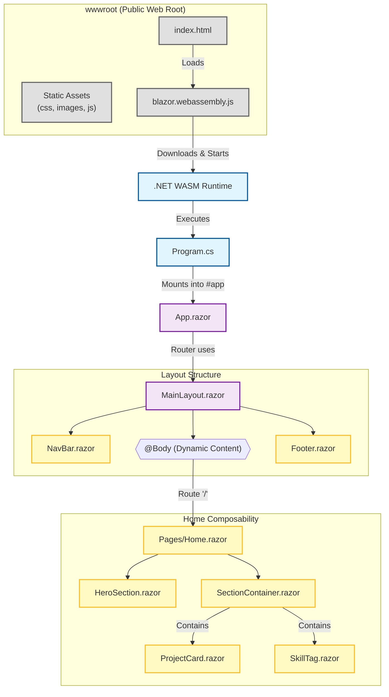

# Blazor WASM Architecture 

```mermaid
graph TD
    %% Browser / Static Hosting Layer
    subgraph wwwroot ["wwwroot (Public Web Root)"]
        Index["index.html"]
        Assets["Static Assets<br/>(css, images, js)"]
        BlazorJS["blazor.webassembly.js"]
    end

    %% Bootstrapping
    Index -->|Loads| BlazorJS
    BlazorJS -->|Downloads & Starts| Runtime[".NET WASM Runtime"]
    Runtime -->|Executes| Program["Program.cs"]
    
    %% Main Application Flow
    Program -->|Mounts into #app| App["App.razor"]
    App -->|Router uses| Layout["MainLayout.razor"]
    
    %% Layout Structure
    subgraph LayoutStructure ["Layout Structure"]
        Layout --> NavBar["NavBar.razor"]
        Layout --> Body{{"@Body (Dynamic Content)"}}
        Layout --> Footer["Footer.razor"]
    end

    %% Page Injection
    Body -->|Route '/'| Home["Pages/Home.razor"]

    %% Component Usage in Home
    subgraph HomeComposability ["Home Composability"]
        Home --> Hero["HeroSection.razor"]
        Home --> Section["SectionContainer.razor"]
        
        %% Nesting
        Section -->|Contains| Card["ProjectCard.razor"]
        Section -->|Contains| Skill["SkillTag.razor"]
    end

    %% Styling
    classDef main fill:#e1f5fe,stroke:#01579b,stroke-width:2px;
    classDef component fill:#fff9c4,stroke:#fbc02d,stroke-width:2px;
    classDef core fill:#f3e5f5,stroke:#7b1fa2,stroke-width:2px;
    classDef static fill:#e0e0e0,stroke:#616161,stroke-width:2px;
    
    class Home,NavBar,Footer,Hero,Section,Card,Skill component;
    class Layout,App core;
    class Program,Runtime main;
    class Index,Assets,BlazorJS static;
```